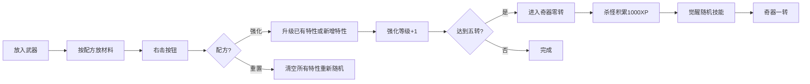

# Supermodel Boost - 武器&护甲强化系统

> **PFWs 出品** | 纯服务端 Fabric 模组 | MC 26.1.1+
>
> 通过搭建强化台结构，使用发射器配方为武器和护甲随机附加特性。
> 武器更有**主动技能系统**：五转觉醒、快速潜行两下释放技能、三大倾向体系！

---

## 📦 模组信息

| 项目 | 详情 |
|------|------|
| **模组名称** | Supermodel Boost - 武器&护甲强化系统 |
| **模组ID** | `supermodel_boost_server_pfws` |
| **版本** | 1.0.0 |
| **作者** | PFWs |
| **运行环境** | 纯服务端 (Server-Side) |
| **许可证** | Apache-2.0 |
| **Minecraft** | 26.1.1+ |
| **Fabric Loader** | >= 0.19.3 |
| **Java** | >= 25 |

---

## ✨ 功能特性

### 🏗️ 三种强化台结构

在游戏中搭建特定方块结构，右击发射器上的按钮即可触发：

| 强化台 | 结构组成 | 用途 |
|--------|----------|------|
| **武器强化台** | 2个附魔台中间夹发射器 + 发射器上方放按钮 | 武器强化/重置 |
| **护甲强化台** | 2个铁砧中间夹发射器 + 发射器上方放按钮 | 护甲强化/重置 |
| **倾向祭坛** | 2个信标中间夹发射器 + 发射器上方放按钮 | 武器倾向注入 |

> 按钮支持**全方向fallback检测**，即使按钮朝向不对也能正确匹配发射器。

### ⚔️ 武器特性 (7种)

| 特性ID | 名称 | 最大等级 | 效果描述 |
|--------|------|:------:|----------|
| `lifesteal` | 吸血 | 3 | 攻击恢复造成伤害 10%/20%/30% 的生命 |
| `retaliation` | 反击 | 2 | 受到伤害时储存，下次攻击释放 50%/70% |
| `berserker` | 战狂 | 3 | 攻击获得 2/3/4 秒力量 1/2/3 |
| `tough` | 硬朗 | 2 | 耐久损耗降低 35%/50% |
| `flexible` | 韧性 | 2 | 最大耐久增加 15%/20% |
| `multi_tool` | 千手 | 3 | 镐3x3挖掘 / 铲急迫 Lv.1/2/3 |
| `exhilaration` | 兴奋 | 3 | 造成伤害后获得 2/3/4 秒速度 1/2/3 |

> **互斥组**: `硬朗` 与 `韧性` 属于同一互斥组，无法共存。

### 🔮 武器主动技能系统 (6种)

武器强化至五转后进入**奇器零转**，击杀怪物积累经验觉醒技能。快速潜行两下释放！

**强化等级体系**: 未强化 → 一转 → 二转 → 三转 → 四转 → 五转 → 奇器零转 → 奇器一转 → ... → 奇器五转

| 技能ID | 名称 | 倾向 | 效果简述（一转） |
|--------|------|:--:|------|
| `heart_explosion` | 暴戾·心爆 | 🔴暴戾 | 获得10秒力量一，扣除6血，CD45秒 |
| `madness` | 暴戾·失智 | 🔴暴戾 | 4秒内未伤敌则中毒二；每击获2秒力量（最高2层），持续40秒，CD180秒 |
| `avoid_battle` | 丰饶·避战 | 🟢丰饶 | 4秒隐身，10秒生命恢复一，2秒速度二，CD80秒 |
| `self_rescue` | 丰饶·自救 | 🟢丰饶 | 持续30秒。濒死时恢复至30%血量，获40秒生命提升二、8秒生命恢复二、70秒抗火，CD280秒 |
| `self_strengthen` | 血使·自强 | 🔴血使 | 扣8血获20秒力量一，4秒后获16秒生命提升10、2秒生命恢复一，每击回1血（持续20秒），CD80秒 |
| `atavism` | 血使·返祖 | 🔴血使 | 40秒内体型变大40%，获45秒缓慢二、38秒力量二，每击回1血，CD90秒 |

> 仅**剑(SWORD)** 和 **斧(AXE)** 可获得主动技能。

### 🧭 倾向系统 (Tendency)

三大倾向影响觉醒技能走向（80%权重获得倾向对应技能）：

| 倾向 | 材料 | 对应技能 |
|------|------|----------|
| 🔴 **暴戾** (Violent) | 腐肉 | 心爆、失智 |
| 🟢 **丰饶** (Abundance) | 骨粉 | 避战、自救 |
| 🔴 **血使** (Blood) | 生牛肉 | 自强、返祖 |

> ⚠️ **限制**: 仅奇器零转（五转、未觉醒）武器可在倾向祭坛设置倾向。已觉醒技能后不可更改。

### ⚡ 主动技能激活

- **操作**: 快速潜行两下（600ms 窗口内）
- **BossBar**: 激活时显示技能名称 + 冷却进度条
- **经验获取**: 击杀怪物 +5XP，使用技能 +20XP
- **经验阈值**: 一转1000 → 二转2000 → 三转4000 → 四转8000 → 五转20000
- **Lore**: 先清除再重建，实时显示最新经验和技能状态

### 🛡️ 护甲特性 (8种)

| 特性ID | 名称 | 最大等级 | 效果描述 |
|--------|------|:------:|----------|
| `iron_wall` | 铁壁 | 5 | 减少受到的所有伤害 |
| `vampire` | 吸血 | 5 | 攻击恢复造成伤害比例的生命值 |
| `thorns` | 荆棘 | 5 | 反弹近战伤害给攻击者 |
| `revive` | 复苏 | 3 | 每间隔一段时间自动恢复生命值 |
| `bulletproof` | 箭矢防护 | 4 | 减少弹射物造成的伤害 |
| `magic_ward` | 魔御 | 4 | 减少魔法伤害 |
| `sturdy` | 坚韧 | 3 | 护甲耐久损耗降低 |
| `lightweight` | 轻盈 | 5 | 增加移动速度 |

> 护甲特性同样支持互斥组，同组特性无法共存。

---

## 🎮 使用方法

### 指令系统 `/sboost`

所有功能通过 `/sboost` 统一管理，权限要求 `LEVEL_GAMEMASTERS` (OP)：

#### 武器子命令

```
/sboost weapon info                              - 查看手持武器特性
/sboost weapon add <target> <trait> [level]       - 添加武器特性
/sboost weapon remove <target> <trait>            - 移除武器特性
/sboost weapon clear <target>                     - 清除所有武器特性
/sboost weapon setlevel <target> <trait> <level>  - 设置特性等级
/sboost weapon setenhance <target> <level>        - 设置强化等级 (0-5)
```

#### 技能子命令

```
/sboost weapon skill info                         - 查看手持武器技能详情
/sboost weapon skill settendency <target> <t>     - 设置倾向 (violent/abundance/blood/none)
/sboost weapon skill setlevel <target> <level>    - 设置技能等级 (1-5)
/sboost weapon skill setxp <target> <xp>          - 设置技能经验值
/sboost weapon skill clear <target>               - 清除所有技能数据
/sboost weapon skill setskill <target> <id> [lvl] - 设置技能 (默认1级=奇器·一转)
/sboost weapon skill clearcooldown <target>       - 清除技能冷却
```

#### 护甲子命令

```
/sboost armor info                                - 查看身上护甲特性
/sboost armor add <target> <slot> <trait> [lvl]   - 添加护甲特性 (slot: head/chest/legs/feet/mainhand)
/sboost armor remove <target> <slot> <trait>      - 移除护甲特性
/sboost armor clear <target>                      - 清除所有护甲特性
/sboost armor setlevel <target> <slot> <t> <lvl>  - 设置护甲特性等级
```

#### 全局命令

```
/sboost reload                                    - 重载配置文件
```

### 强化配方

| 操作 | 上下左右 (4格) | 四角 (4格) |
|------|:---:|:---:|
| **武器强化** | 钻石 | 青金石 |
| **武器重置** | 青金石 | 空 |
| **倾向注入** | 倾向材料×8（全部8格同一材料） | 同左 |

### 强化流程



### 武器 Lore 显示格式

```
✦ 强化等级 五转

⚔ 武器特性 ⚔
  ◆ 吸血 Lv.3
     ↳ 攻击恢复造成伤害 30% 的生命
  ◆ 战狂 Lv.2
     ↳ 攻击获得 3 秒力量 2

⚡ 主动技能系统 ⚡
  技能: 丰饶·自救 奇器·一转
     持续30秒。期间若濒死，恢复至30%血量，获40秒生命提升二、8秒生命恢复二、70秒抗火，CD280秒
  倾向: 丰饶
  经验: 80/1000
```

### 适用物品

- **武器强化台**: 所有剑、斧、镐、铲、锄、三叉戟、重锤（支持通配符 `*_sword`, `*_axe` 等）
- **倾向祭坛**: 同上，但仅强化等级 ≥5 的武器
- **主动技能**: 仅剑(SWORD)和斧(AXE)
- **护甲强化台**: 头盔、胸甲、护腿、靴子（所有材质）

---

## ⚙️ 配置说明

配置文件: `config/supermodel_boost_server_pfws/config.json`

```json
{
  "enable_weapon_forge": true,
  "enable_armor_forge": true,
  "remove_level_cap_for_ops": false,
  "log_forge_actions": true,
  "debug_mode": false,
  "weapon": {
    "max_traits": 4,
    "min_traits": 0,
    "exclude_traits_conflict": true,
    "max_enhance_level": 5,
    "trait_probabilities": [0.90, 0.60, 0.20, 0.05],
    "level1_chance": 0.60,
    "level2_chance": 0.30,
    "level3_chance": 0.10,
    "applicable_items": ["*_sword", "*_axe", "*_pickaxe", "*_shovel", "*_hoe", "trident", "mace"],
    "reset_material": "minecraft:lapis_lazuli",
    "enhance_main_material": "minecraft:diamond",
    "enhance_corner_material": "minecraft:lapis_lazuli"
  },
  "armor": { ... }
}
```

| 配置项 | 说明 | 默认值 |
|--------|------|--------|
| `enable_weapon_forge` | 启用武器强化台 + 倾向祭坛 | `true` |
| `enable_armor_forge` | 启用护甲强化台 | `true` |
| `debug_mode` | 调试模式（额外日志） | `false` |
| `weapon.max_traits` | 武器最多特性数 | 4 |
| `weapon.max_enhance_level` | 武器最大强化等级 | 5 |
| `armor.max_traits` | 护甲最多特性数 | 3 |
| `trait_probabilities` | 获得 1/2/3/4 个特性的概率 | `[90%, 60%, 20%, 5%]` |
| `level1_chance` | 特性为1级的概率 | 60% |
| `level2_chance` | 特性为2级的概率 | 30% |
| `level3_chance` | 特性为3级的概率 | 10% |
| `reset_material` | 重置配方材料 | 青金石 |
| `enhance_main_material` | 强化主材料 | 钻石 |
| `enhance_corner_material` | 强化副材料 | 青金石 |

---

## 🔧 技术细节

### 经验系统

| 来源 | 经验 | 触发条件 |
|------|:---:|------|
| 击杀怪物 | +5 | `AFTER_DEATH` 事件 |
| 使用技能 | +20 | 双击Shift激活技能 |

- Lore 刷新策略: **先清除再添加** (`remove(DataComponents.LORE)` → `updateAllLore`)
- 技能升级后自动扣除对应阈值经验（如 1000/1000 → 升级 → 0/2000）

### 技能滚动权重

觉醒时倾向提供 **80% 权重**：
- 未设倾向 → 所有6技能等权重
- 暴戾倾向 → 心爆/失智各40% + 其余4技能各5%
- 丰饶倾向 → 避战/自救各40% + 其余4技能各5%
- 血使倾向 → 自强/返祖各40% + 其余4技能各5%

### NBT 存储

使用 `DataComponents.CUSTOM_DATA` 存储所有模组数据：

```
武器技能:  supermodel_skill_id, supermodel_skill_level, supermodel_skill_xp,
           supermodel_cooldown_end, supermodel_tendency
武器特性:  weapon_traits, weapon_enhance_level
护甲特性:  armor_traits, armor_total_reinforce_level
```

### 自救技能处理

自救通过 `ServerLivingEntityEvents.ALLOW_DAMAGE` 拦截致命伤害，而非事后补救。
触发后直接 `return false` 取消伤害，并施加生命提升/生命恢复/抗火 Buff。

---

## 🔨 开发构建

### 环境要求

- JDK 25+
- Gradle (Wrapper 已包含，无需手动安装)
- Minecraft 26.1.1

### 构建命令

```bash
# Windows
gradlew build

# Linux/macOS
./gradlew build
```

构建产物: `build/libs/supermodel_boost_server_pfws-1.0.0.jar`

### 依赖管理

```gradle
repositories {
    mavenCentral()
    maven { url = "https://maven.fabricmc.net/" }
}

dependencies {
    minecraft "com.mojang:minecraft:26.1.1"
    mappings "net.fabricmc:yarn:26.1.1+build.1:v2"
    modImplementation "net.fabricmc:fabric-loader:0.19.3"
    modImplementation "net.fabricmc.fabric-api:fabric-api:0.145.2+1.21.5"
}
```

### 项目结构

```
src/main/java/com/pfws/supermodel/boost/
├── SupermodelBoost.java              # 模组入口
├── SupermodelBoostConfig.java        # 配置管理
│
├── model/
│   ├── WeaponTrait.java              # 武器特性数据模型
│   ├── ArmorTrait.java               # 护甲特性数据模型
│   └── ItemType.java                 # 物品类型枚举
│
├── handler/
│   ├── StructureHandler.java         # 结构检测与配方处理
│   ├── CommandHandler.java           # /sboost 指令处理
│   ├── EventHandler.java             # 事件处理器
│   ├── LoreUpdateHelper.java         # Lore 显示统一管理
│   └── ConfigLoader.java             # 配置加载
│
├── weapon/
│   ├── WeaponTraitRegistry.java      # 武器特性注册
│   ├── WeaponTraitNbtHelper.java     # 武器特性 NBT 操作
│   ├── WeaponTraitApplier.java       # 武器特性效果实现
│   └── skill/
│       ├── ActiveSkill.java          # 主动技能数据模型
│       ├── ActiveSkillRegistry.java  # 主动技能注册
│       ├── ActiveSkillNbtHelper.java # 技能 NBT 操作
│       └── SkillActivationHandler.java # 技能激活与效果
│
└── armor/
    ├── ArmorTraitRegistry.java       # 护甲特性注册
    ├── ArmorTraitNbtHelper.java      # 护甲特性 NBT 操作
    └── ArmorTraitApplier.java        # 护甲特性效果实现

src/main/resources/
├── fabric.mod.json                   # Fabric 模组元数据
└── assets/supermodel_boost_server_pfws/
    └── lang/
        └── zh_cn.json                # 中文本地化
```

---

## 🐛 常见问题

### Q: 强化台不触发？
- 确认是纯服务端（Server-Side），客户端无需安装
- 确认发射器**上下左右 4 格 + 四角 4 格**共 8 格均放入了正确材料
- 确认按钮放置于发射器**正上方**

### Q: 倾向祭坛无法设置倾向？
- 确认武器强化等级 ≥ 5（即五转或奇器零转）
- 确认武器**尚未觉醒技能**（已觉醒后不可更改倾向）
- 确认发射器周围 8 格全部放入同一倾向材料

### Q: 快速潜行两下不触发技能？
- 确认武器已有技能（Lore 中显示技能名称）
- 确认在 600ms 窗口内快速潜行两下
- 确认不是副手
- 确认技能不在冷却中

### Q: Lore 不更新或显示错误？
- 所有 NBT 修改操作现已调用 `remove(DataComponents.LORE)` + `updateAllLore` 实时刷新
- 如仍有问题，使用 `/sboost weapon info` 手动查看

---

## 📄 许可证

本模组基于 [Apache-2.0](LICENSE) 协议发布。

---

> 💡 **提示**: 此模组为纯服务端模组，只需安装在服务器端即可生效。客户端无需安装即可加入服务器享受完整特性！（若为本地游玩可无视本提示）